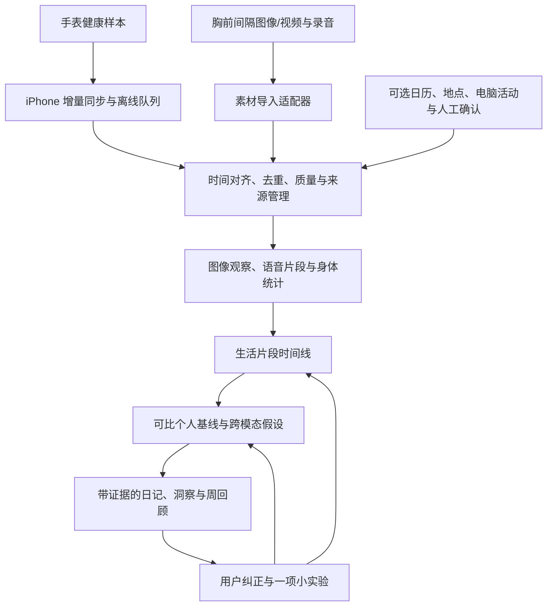

# AI Watch 重规划：低打扰的每日生活复盘

日期：2026-09-12。状态：研究与开发提案，以下新能力尚未实现。

审视基线：[`32e4515`](https://github.com/xiemingtian199/AI-watch/commit/32e4515307f63f2c6521808e6bd3442205a6dbad)。本次已通过 GitHub API 和本地 fetch 核对默认分支；研究前远端与本地一致。检查了四个 Python 模块、浏览器脚本和现有文档，并运行合成输入的行为探针。本次没有读取私人健康导出或录音，没有进行设备佩戴实测、模型效果评测或业务代码修改。

## 1. 建议结论

把项目定位为**个人生活事件与身体状态的复盘系统**。主要体验是：白天低打扰记录，晚上自动看到一天的主要经历、值得回看的变化、资料缺失的时段，以及一个可验证的小调整。长期形成可搜索、可纠正的个人记忆和周度观察。

最值得投入的差异化是把“发生了什么”“身体有什么变化”“本人如何解释”对齐，并保留证据和不确定性。摄像头负责提供场景素材；手表提供身体信号；模型负责整理和提出假设；用户的确认负责校准。

建议优先采用 **Apple Watch + iPhone 数据桥接 + 可替换的音视频采集设备 + 当前 Python 本地服务**。先验证现成设备的素材获取和佩戴体验，再决定是否开发胸前硬件。视觉采集仍是完整路线的一部分，不能用音频转写代替并宣称已经完成多模态目标。

“无感”定义为少操作、少打扰：初次授权后，日常只需佩戴、充电，必要时一键暂停；每天可以用 30-60 秒纠正关键误解。日常授权采集状态应始终可知，不以隐蔽录制为产品目标。

## 2. 现有方案核实

以下事实核查截至 2026-09-12；销售页参数是厂商声明，实际续航、跨地区服务、价格和接口权限仍需在购买/接入时验证。

| 方案 | 官方资料能确认什么 | 对本项目的价值与限制 |
| --- | --- | --- |
| Looki L1 | 胸前/挂绳佩戴的音视频生活记录设备，提供自动日记、回顾；商品页可下单，标价 US$249。官方说明支持间隔采集。 | 与用户描述最接近，中文网页称“AI 生活主理人”；“人生规划器”是否确为此产品仍未确认。适合作为视觉与音频入口候选。 |
| Omi | 官方提供开源硬件、固件、App、后端，以及记忆、对话和待办的开发者 API，可自托管。 | 适合研究音频事件管线、数据开放和二次开发；不能仅凭语音记录覆盖无声场景。 |
| Plaud NotePin / NotePin S | 可穿戴录音产品；当前开发者平台提供 Device SDK/转写 API，已有账户数据另有 MCP/CLI 入口。 | 适合录音与结构化对话接入；设备 SDK 与已有 Plaud 账户接口是两种路径，不能混用权限假设；不提供胸前视觉记录。 |
| Limitless Pendant | 官方公告已被 Meta 收购，2025-12-05 起停止销售新 Pendant，并停止中国等地区的服务。 | 可参考记忆检索体验，但不作为这个项目的新采购主路线。 |

依据：[Looki 商品页](https://www.looki.ai/products/looki-l1)、[Looki 中文网页](https://web.looki.tech/)、[Omi 开源说明](https://docs.omi.me/doc/get_started/introduction)、[Omi API](https://docs.omi.me/doc/developer/api/overview)、[Plaud NotePin](https://www.plaud.ai/products/plaud-notepin)、[Plaud 开发者平台](https://dev.plaud.ai/)、[Plaud MCP](https://docs.plaud.ai/plaud-mcp-cli/mcp)、[Limitless 公告](https://www.limitless.ai/?source=post_page-----1a789f683288--------------------------------)。

### Looki 是优先核查对象，但还不是已验证的接入方案

官方技术页列出约 32g、32GB、1080p 视频，以及“每分钟 5 秒 / 每 2 分钟 9 秒 / 每 3 分钟 11 秒”的间隔方案，对应约 9/11/13 小时续航。因而用户记忆中的“低分辨率采样”更接近低占空比记录，不能直接说该产品只拍低分辨率素材。[Looki 技术规格](https://www.looki.ai/pages/looki-l1)

2026-08-10 官方发布了 API 接入介绍，提到需申请权限，可查询当天经历、时刻及相关照片/视频。这让“用现成采集设备接入自己的复盘系统”成为值得优先做的验证。公开 API 页面本次未返回可读的端点细节，因此目前**没有确认**批量原始媒体导出、音轨完整性、时间戳精度、分页/限流、费用、地区权限或 HealthKit 现成集成。[Looki API 介绍](https://www.looki.ai/blogs/news/looki-for-codex)、[API 入口](https://web.looki.ai/api-references)

官方 App 说明也描述了已上传云端的素材库；不能把设备有本地分析能力等同于整条流程离线。集成前应明确素材经过哪些服务。[Looki App 说明](https://support.looki.ai/hc/en-001/articles/49659999171737-Looki-App)

选型验证顺序：先取得一段合法可用的样例和接口访问，检验媒体/音轨/绝对时间/删除流程；再做半天和全天佩戴测试。若只能拿到厂商摘要，将它标为“外部生成的解释”，不当作原始观察。接口不可用时，保留本地文件加 manifest 导入；视觉原型可用支持素材导出的设备完成。

## 3. 当前代码离目标的主要差距

现有代码已经有健康数据转换、录音导入、可选本地转写、复盘卡片与反馈 UI，适合继续演进。但当前主路径仍是手工导入和规则演示。

| 优先级 | 发现与代码证据（均相对审视基线） | 用户影响 | 推荐改动 |
| --- | --- | --- | --- |
| P0 | `src/generate_cards.py:267-281`：存在任何人工工作上下文，就输出写死的工作/午休时间和“今天没有会议”。 | 新的一天会被旧实验叙述覆盖。 | 删除固定事实；按当天事件区间和来源生成叙述；冲突显式显示。 |
| P0 | `src/generate_cards.py:283-317`：聊天备注可触发语速/心率/地点重叠结论；任意 22 点后事件可触发恢复受影响的文案。 | 支撑材料不足却给出身体/行为解释。 | 数值判断走确定性计算；文本结论逐条要求证据；允许无结论。 |
| P0 | `src/local_app.py:211-214`：静态路径 resolve 后未检查是否仍在 `app` 内。 | `../` 路径可以解析到目录外；本机监听也需要访问边界。 | 拒绝目录外路径、验证请求来源；在增加手机同步之前解决。 |
| P1 | `src/convert_apple_health.py:124-156,164-178`：健康事件只保留结束时间；按钟点推断工作/午休等活动。 | 跨午夜睡眠、跨小时累计值失去区间；周末也被标成工作。 | 保留 start/end、原始来源与设备信息；时段只是弱先验，不能变成场景事实。 |
| P1 | `src/generate_cards.py:26-39,92-104`：按日期字符串选取并排序；步数按事件所在小时直接相加。 | 不同偏移、跨天区间、重复导入和多设备重叠会破坏比较。 | 统一 UTC 与展示时区，按区间相交分日，按类型处理累计/离散数据，增加去重和来源策略。 |
| P1 | `src/transcribe_audio.py:43-65` 与 `src/local_app.py:122-154`：粗转写另存为 `.raw-transcript.json`（实际逐行 JSON）；复盘主要使用录音元数据和人工摘要。 | “能转写”尚未形成自动场景理解。 | 转写产物格式规范化；增加片段、说话人、媒体播放/真实交谈分类，再导入可追溯观察。 |
| P1 | `src/local_app.py:152,172`：音频记录和转写产物按开始分钟命名。 | 同一分钟开始的两个文件可能覆盖。 | 用稳定媒体 ID/哈希命名，保留来源文件关系与导入事务。 |
| P1 | `src/local_app.py:23,99` 与 `app/app.js:4,80-87`：单个 `cards.json`；反馈按通用 card ID 存 localStorage。 | 多天结果覆盖，反馈会串到其他日期，也没有进入下一次生成。 | 按日期/事件/版本存报告；反馈存服务端并关联 evidence、episode、rule version。 |
| P1 | `src/generate_cards.py:107-148,344,347-393`：当天中位数作比较、固定置信度、直接截前八张；云模式整天 JSON 加提示后 `json.loads`。 | 个人基线不足，材料多时后续重要卡片被丢弃，模型输出缺少事实和结构验证。 | 建立跨天可比基线、证据等级、覆盖检查、排序去重、schema 与引用校验。 |
| P2 | 当前没有视觉导入/场景分段/iPhone 自动同步/周度比较。 | 尚不能达到低打扰的全日复盘。 | 见后续分阶段路线，纳入完整交付标准。 |

`generate_for_date` 当前明确调用本地 `heuristic_cards`，网页不会因为设置了云端模型名自动获得多模态能力。命令行的 `--cloud` 是另一条路径，默认模型为 `gpt-4.1-mini`，输入也只是 JSON 文本。两条路径未来应共用同一份分析与验证管线。

### 已执行的行为检查

均为内存合成事件或公开仓库样例，使用当前 Python 运行函数，不代表实际全天精度评估。

| 输入 | 实际观察到的结果 |
| --- | --- |
| 2026-09-12 15:00，一条 `manual_context` / `meeting` | 工作卡仍断言固定工时、午休和“今天没有会议”。 |
| 23:00，仅一条心率 60 的记录 | 出现 `card-night-routine`，声称可能影响从工作到休息的切换。 |
| 12:00，仅一条 `family_chat` 备注 | 出现 `card-relationship`，声称存在语速/心率/地点重叠信号。 |
| 两个不同日期、各一条工作事件 | 两天复用 `card-work-mode` 和 `card-action-tomorrow` ID。 |
| 星期六 15:00 的健康样本 | `infer_activity` 返回 `work`。 |
| 对 `LocalHandler.translate_path` 输入 `/../PROJECT_STATE.md` | 解析路径位于 `APP_DIR` 之外；仅检查路径，没有读取目录外内容或启动攻击请求。 |
| `data/sample` 中 2026-06-01 的样例 | 24 条事件生成 7 张卡。 |

这些探针确认了需修复的行为；完整原型验收仍需后续自动回归、服务接口验证和真人佩戴数据。

## 4. 目标体验

每天的输出分为四部分：

1. **今天做了什么**：可折叠的生活片段时间线，例如通勤、开会、连续处理某项工作、用餐、交流、休息。允许未知和并行活动，原始心率点放到下钻视图。
2. **哪些时段值得回看**：身体负荷偏离、较少被打断的工作段、可能有助恢复的休息；每条显示证据、替代解释和缺失数据。
3. **留下什么**：值得保留的瞬间、本人明确作出的承诺/待办、可搜索的经历。涉及他人身份或承诺时需可靠上下文，不能由不确定说话人自动归到本人。
4. **明天试什么**：最多一个由用户选择的小调整，并在以后同类场景里回看。没有充分依据时只给事实总结，不强行生成建议。

首页先显示当天生活片段和数据覆盖；提供日期切换、场景纠正、证据回放与当天删除。导入工具保留为辅助页。日常不要求逐条填写场景，最多集中询问 1-3 个影响最大的歧义，可跳过。每周汇总时间投入、恢复节奏、重复经历与用户自定目标，避免把每一天变成生产力评分。

**预期输出示例（完全虚构）**：

> 14:10-14:45 可能在讨论项目：录音有相关话题，日历也有对应安排。该时段有 4 个有效心率样本，整体高于近两周可比较的静坐讨论窗口；同时不能排除走动或其他影响。你可以确认当时是紧张、投入还是普通交流。单凭这些信息不能判定“这次会议导致压力”。

最终产品需要同时覆盖普通、愉快、安静和空白时段；只挑心率峰值会让一天的叙事系统性偏向负面。

## 5. 采集与分析架构

### 5.1 采集策略

| 来源 | 建议初始策略 | 必须保留的信息与限制 |
| --- | --- | --- |
| Apple Watch | 心率、静息心率、HRV、睡眠、活动/运动样本；先沿用文件导入，随后用 iPhone 自动增量同步。 | 起止时间、时区、单位、样本/设备/来源标识、导入版本；不要假设每秒都有数据。 |
| 胸前视觉 | 可配置地每 1-3 分钟取短片或关键帧；场景变化时可加密采样，稳定场景做去重；全天保留最低采样频率。 | 原始媒体时间、相对帧位置、遮挡/模糊/暗光、暂停/断电区间。事件触发不能取代基础采样，否则会漏掉安静生活。 |
| 音频 | 先做语音活动检测、分段转写与环境类别；保留安静/交通等声音观察；只有授权的内容进入语义分析。 | 录制时间与实际墙钟的映射、分段置信信息、重叠说话、媒体播放标记。语音触发录音若压掉静默，不能用“文件开始 + 播放位置”推算真实时刻。 |
| 日历/地点 | 经授权作为辅助信息，地点先保留语义区域即可。 | 日历是计划，不能当作已经发生；不要依靠地点认定具体工作内容。 |
| 可选电脑活动 | 当“专注”是主要目标时，记录应用类别/切换/空闲时间等粗粒度信号。 | 用户主动开启；仅作为连续工作线索，不把窗口开着等同于专注，也不需要默认截屏或键盘内容。 |

Apple 官方说明后台心率采样随活动而变化；HealthKit 的 HRV 类型为 SDNN，而非任意品牌 HRV 分数或 RMSSD。后台通知可以由 observer query 配合 anchored query 读取增删样本，但这不保证实时或固定刷新频率。iPhone 端需持久化 anchor、幂等重试、断网补传和删除标记，并在真机验证后台同步。[Apple 心率采样](https://support.apple.com/en-us/120277)、[HRV 定义](https://developer.apple.com/documentation/healthkit/hkquantitytypeidentifier/heartratevariabilitysdnn)、[后台查询](https://developer.apple.com/documentation/healthkit/executing-observer-queries)

当前环境为 Windows，可继续开发服务端与文件适配器；原生 iPhone 桥接的构建、签名和真机验证需要可用的 macOS/Xcode 环境与设备。不能将 Windows 上的文件导入脚本视为已经完成 iOS 自动同步。

### 5.2 时间、存储和证据

建议保留 JSONL 作为导入/导出协议，增加 SQLite 存事件、片段、生成版本、反馈和处理任务；媒体保存在受控的私有目录。先保持单机 Python 服务，使用可恢复的后台 worker 处理耗时任务。

建议的数据对象：

| 对象 | 必要字段/职责 |
| --- | --- |
| `Observation` | 稳定 ID、source/device、start/end UTC、原始时区、原始时间、clock offset/误差范围、单位、质量、来源文件/样本 ID、哈希、解析版本。 |
| `Episode` | 时间区间、场景候选与依据、已知/推断/用户确认状态、关联 observation IDs、数据空白和冲突。 |
| `Insight` | 结论、支持/反对证据 IDs、数值统计引用、替代解释、基线范围、模型与提示版本、状态。 |
| `Feedback` | 日期、episode/insight ID、版本、修正值、用户自报体验；能使相关解释和后续报告失效重算。 |
| `DailyReview` | 日期与时区、版本、素材覆盖、生活片段、洞察、已确认待办、生成成本与处理状态。 |

区间按当地日界裁切，原始区间不丢失。统一用 UTC 计算先后，使用 IANA 时区呈现；时钟漂移或文件时间不明确时不做精确的先后归因。离散心率不连续插值来假装有覆盖；累计步数/能量按各自语义聚合，多设备重叠须明确来源优先或保留争议。每条结论可回到证据的原始区间；模型摘要不能循环引用另一份摘要当成新增独立证据。

### 5.3 压力、专注和恢复的处理

把输出拆成三层：**观测事实**、**可检验假设**、**用户确认**。不要把“心率高”“安静”“屏幕未切换”直接变成压力/专注结论。

| 想回答的问题 | 需要的证据 | 可支持的措辞 |
| --- | --- | --- |
| 当时做了什么 | 多帧可见场景、语音话题、实际地点变化、用户确认等 | “可能在通勤”“已确认项目讨论”；素材不足为未知。 |
| 哪些时候压力可能较大 | 同类活动下的身体偏离、活动量与恢复情况、场景背景、本人感受 | “低活动时段出现较高身体负荷，值得回看”；本人确认后记录主观压力。 |
| 哪些时候更专注 | 连续任务片段、较少切换/打断、本人目标与完成感；身体信号仅作辅助 | “较少被打断的连续工作段”；无行为证据时不输出专注分数。 |
| 什么可能有帮助 | 多天同类情境、用户选择的小调整、前后自报体验与可比统计 | “这几次散步后自报更放松”，不把相关性写成因果。 |

自由生活环境的研究指出，活动会同时改变心率等生理信号，影响压力区分；个体差异也重要。因此“多模态 + 个人基线 + 少量自报”是设计原则，而非已经得到医学验证的压力检测器。[原始研究：Large-scale wearable data reveal digital phenotypes for daily-life stress detection](https://www.nature.com/articles/s41746-018-0074-9)

个人基线先设计为过去 14-28 天的滚动参考，并按活动/睡眠状态、时段、设备与采样协议分组。第一周只显示描述性统计；可比天数/有效样本不足时不显示偏离等级。有效窗口可从 5-15 分钟试起，记录样本数与间隔；这些是工程试验参数，需随真实数据调节，不是诊断阈值。使用稳健统计和缺失状态，避免单个峰值支配日记。少量场景的重复出现不能推导“每逢某事都会压力大”。

置信度先展示“证据充分 / 证据有限 / 待确认”，不再把硬编码的 0.8 显示成 80% 正确概率。以后若展示概率，必须用独立标注验证校准。

## 6. 怎样利用当前模型能力

目前官方模型目录列有 GPT-6 Astra，以及偏成本/吞吐取向的 GPT-5.6 Terra、Luna；这为分工提供了候选，不代表已经在本项目评测过。Astra 官方模型页列明支持文本、图像输入与 Structured Outputs，未列为支持直接音频/视频输入，所以下面采用“音频转写 + 视频关键帧 + 统计工具”的管线。[官方模型目录](https://developers.openai.com/api/docs/models)、[Astra 能力说明](https://developers.openai.com/api/docs/models/gpt-6-astra)

| 层次 | 工作分配 | 验证重点 |
| --- | --- | --- |
| 本地预处理 | 现有 FFmpeg/faster-whisper 基础上做素材校验、VAD、去重、片段时间恢复、数值统计。 | 中文/方言、广播误转写、噪声、时钟、CPU 耗时与失败重试。 |
| 场景提取 | 用有图像能力的较轻模型对带时间的关键帧和对应转写输出结构化观察；可对 Terra/Luna 等候选做对照。 | 是否只描述看见/听见的事实；遮挡时是否返回未知；媒体播放是否被当成本人经历。 |
| 日复盘与周比较 | 将片段、统计、冲突、可比历史和少量关键帧交给强推理模型，例如 Astra 候选。 | 全日覆盖、事实引用、替代解释、个体背景；优先处理歧义与有价值的跨天问题。 |
| 输出验证 | JSON schema 校验、引用存在/时间相交、数值来自统计工具、事实与假设分层、内容冲突与重复检测。 | 不合格时重试或退回事实列表，不能只接受“语气比较谨慎”的错误内容。 |

新模型的价值在于跨资料理解、冲突处理和个性化叙述。它不能补回未采集的经历，不能凭图像读心，也不能修复上游错误时钟。Structured Outputs 可以约束格式，但仍可能出现内容错误，需保留程序校验和人工抽检。[Structured Outputs 限制](https://developers.openai.com/api/docs/guides/structured-outputs)

实现时将模型/提示/schema/统计版本记录进产物；同一批经授权的回放材料比较“现有规则”“轻模型”“强模型”，按事实准确、缺失处理、成本与纠正时间选型。冻结已验证配置；可用时固定模型快照。录音和图像中的指令性文字一律作为资料，不允许触发工具操作、上传或改变采集设置。

本地模式保留事实统计和可用的本地转写。云端模式按来源与时段选择授权，先发必要片段；实际账户可用性、地区支持和费用在实现前检查。研究没有调用付费推理接口或上传私人素材。

## 7. 数据量、费用与可持续使用

下面是透明的工程估算，均非设备实测，按每天 12 小时、十进制单位计算：

| 采集假设 | 计算 | 原始量 |
| --- | --- | --- |
| 每分钟 1 张、每张 100-300 KB | 720 张 × 单张大小 | 72-216 MB/天 |
| 每 2 分钟录 5 秒、视频 1-2 Mbps | 360 段 × 5 秒 × 码率 / 8 | 225-450 MB/天 |
| 连续压缩音频 24-64 kbps | 43,200 秒 × 码率 / 8 | 129.6-345.6 MB/天 |

视频和静态图片是不同配置示例，不能当成必须同时累加。实际还要考虑缩略图、重复素材、索引、转码中间产物，以及视频是否已经带有音轨。存储要有可见配额；先按短周期保留原始材料，用户收藏的证据另行保留。

推理成本按“实际帧输入 token + 转写分钟 + 每日/每周输入输出 token + 重试与存储”逐项记账。对于 720 张采样图，可以先在本地筛到几十至一百余张有代表性的关键帧进行试验，但必须测量是否因此漏掉重要经历。强模型每天读结构化片段、必要关键帧和相关历史即可；保留全量素材的索引以便按需查证。预算作为可配置上限，达到上限后延后处理并显示覆盖变化，不能偷偷丢素材或编完日报。

暂停采集、某时段不分析、删除一天、导出资料都是日常产品能力。删除必须覆盖媒体、转写、索引、缓存和衍生报告，并使后续基线失效重算；外部平台的数据删除需展示独立状态。连接 GitHub 只同步代码、研究记录和合成样例。新一轮音视频采集先选择本人可接受、相关人员知情的场景。

## 8. 可执行路线图

以下工期为单开发者原型估算，可根据设备/API/macOS 环境调整；阶段产物与验收门槛比日历承诺更重要。顺序先解决事实可信度，再建立完整自动采集和跨天闭环。

| 阶段 | 估计 | 具体工作 | 完成证据 |
| --- | --- | --- | --- |
| A：可信复盘底座 | 3-5 个工作日 | 修复固定事实和无证据推断、静态路径越界；稳定 ID、区间/时区、去重；隔离演示样例；增加日期/报告版本/服务端反馈。 | 本文复现用例转为回归并通过；跨午夜、多来源、重复导入、跨天反馈不串；未知数据不生成故事。 |
| B：生活片段与视觉文件闭环 | 约 1 周 | 统一 `Observation`；图像/视频/音频 manifest；关键帧与转写观察；场景分段；一条完整的时间线和证据回放；输出 schema/引用验证。 | 合成全天样例及一段授权实录可从素材到片段到日记回溯；空白/广播/遮挡显式表示；视觉与音频都有实际输入。 |
| C：现成设备与自动同步 | 约 1-2 周，依赖设备/接口/开发环境 | 完成 Looki 或其他可导出设备适配器；iPhone HealthKit 增量桥接；离线队列、幂等同步、处理任务进度、夜间自动生成。 | 设备权限、绝对时间、暂停、断网补传和删除测试；连续 3 天无需逐日手工导出/导入即可生成复盘，缺失可见。 |
| D：身体状态与模型融合 | 约 1-2 周，可与收集基线并行 | 数值统计工具、活动混杂处理、个人基线；模型分层、矛盾检查、证据等级；专注线索与可跳过的确认。 | 相同授权材料比较规则与模型输出；无身体数据时不出现身体结论；无工作行为证据时不出现专注评分。 |
| E：两周真实生活验证 | 14 个自然日，前半积累、后半验证 | 佩戴与充电习惯、每天短确认、周度回顾、一项用户选择的小调整；测量视觉增益与日常维护成本。 | 满足下节验收目标，提供失败样本与分日结果；不满足时缩小推断范围并修复，继续保留完整目标。 |

第一批推荐开发任务及落点：

1. `src/generate_cards.py`：把结论生成与数值计算分离，替换 P0 文案，建立证据门槛；`src/local_app.py` 修复目录边界。
2. `src/convert_apple_health.py` 与新增事件存储模块：保留区间、来源、时间误差和稳定 ID；替换按钟点认定工作；增加显式数据集来源。
3. `src/local_app.py` 与 `app/app.js`：按日期查询报告、保存反馈、持久化待处理任务；反馈能重新生成当前日期而不污染其他日期。
4. 新增媒体适配与场景分段模块：支持视觉输入、转写分段及语音触发文件的墙钟映射；跨模态以区间和证据 ID 融合。
5. 新增模型适配与评测模块：共用网页/CLI 入口；提供规则回退、调用预算、输出结构和事实校验；之后接 iPhone 桥接与设备自动同步。

目前不排入首批的工作：自研 PCB/外壳量产、细粒度人物关系评分、实时情绪警报、复杂多用户云平台、全天大模型视频直传。后续硬件只有在导出/续航/隐私控制等实际瓶颈被证实后再决定。

## 9. 如何知道优化真的有效

以下是建议的原型验收目标，不是现有效果、行业基准或医学准确率。两周试用只用于个人方向验证，不能外推至所有人。

| 维度 | 口径 | 初始目标 |
| --- | --- | --- |
| 低打扰 | 第 4 天起，每天导入/排错/修正文案的主动操作时间；佩戴充电另记 | 中位数不超过 2 分钟，异常日单列；复盘阅读时间另记。 |
| 自动生成 | 有预定采集任务的试用日中，无需手工执行命令即产生报告的日数 | 14 天至少 12 天，且不存在未提示的数据缺口。 |
| 采集覆盖 | 有合法有效采样的时间窗 / 用户原定允许采集的清醒时间窗 | 至少 80%；暂停、断电、遮挡和未知分别展示，不能把失败时段移出分母。 |
| 主要经历召回 | 用户看 AI 总结前独立列出的主要事件，系统正确找回的比例 | 至少 80%；按事件计数，并记录时间边界误差。 |
| 事实可信 | 被抽检的可核验原子陈述中，有证据且正确的比例 | 至少 95%；严重虚构事件为 0。覆盖率单独报告，不能靠只说一句话通过。 |
| 推断克制 | 缺失/矛盾/媒体播放/运动后高心率等负例中的不当推断 | 首批回归集不允许无依据的心理、关系和恢复结论。 |
| 视觉增益 | 同一日期材料，分别用健康+音频与加入视觉的输出，盲序比较 | 在保持事实可信门槛下，召回/纠正时间/记忆价值至少一项有可观察改善，否则调整采样与佩戴方式。 |
| 可持续价值 | 用户每周标记“值得保留或帮助理解自己”的内容 | 每周至少 3 条，同时记录负担、反感和不想被分析的时段。 |

建议前 7 天调参与积累基线，后 7 天冻结规则/提示做回放评估。比较必须使用同一份素材、相同问题和盲序展示，不能用自己的模型给自己打分作为唯一依据。原始证据和人工确认留在私有目录；提交到 GitHub 的评测报告只含合成反例、汇总指标和已脱敏的问题类型。

必要失败样本包括：未佩戴/设备没电、镜头被衣服挡住、纯广播、陌生人对话、同一分钟多录音、跨午夜/时区、重复健康记录、运动后高心率、只有日历没有出席证据、安静休闲被误当工作、转写与用户纠正矛盾、API 超时/费用上限、删除后旧结论残留。每个失败样本都应验证降级行为。

## 10. 开发接续说明

这次完成的是最新资料核查、代码重新审视、合成反例验证和开发规划。设备名称是高匹配候选，实际接口、穿戴续航、模型准确率和全自动同步尚未验证。现有 README 的运行方式保持可用，`IMPLEMENTATION.md` 中早期“第二三周自研硬件”的建议作为历史记录；后续排期以本提案为讨论基线。

建议下一次开发从阶段 A 开始，同时收集设备 API/样例可用性；阶段 B 建立视觉闭环，阶段 C 消除日常手动导入，阶段 D/E 再验证压力、专注和跨天价值。最终验收必须包含音视频场景、身体信号、自动同步、可信复盘和低打扰反馈这五部分。
